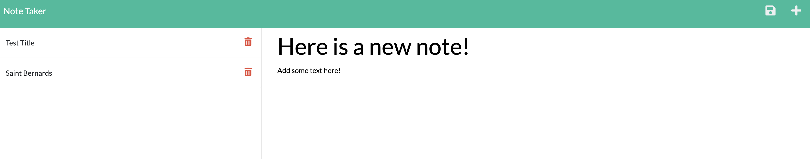

# Note_Taker

## Description

This is a tool designed to organize your notes. We have the functionality to add a new note, view completed notes, and to delete a note that is no longer needed. 

## Installation

1. Open VS Code Terminal
2. Enter `npm i inquirer@8.2.4` into the command line

## Usage

1. Open "Note_Taker" in Visual Studio Code
2. Open Integrated Terminal
3. Install Inquirer (refer to steps above)
4. Type "node server.js" into the command line
5. Using either your browser or a tool such as Insomnia, enter http://localhost:3001 to get started.

## Credits

-This video was referenced for the delete functionality:
  https://www.youtube.com/watch?v=L72fhGm1tfE&t=3364s
-Also referenced past course material and code

## License

  
---